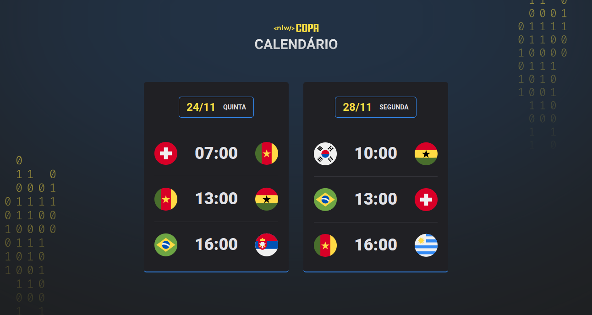
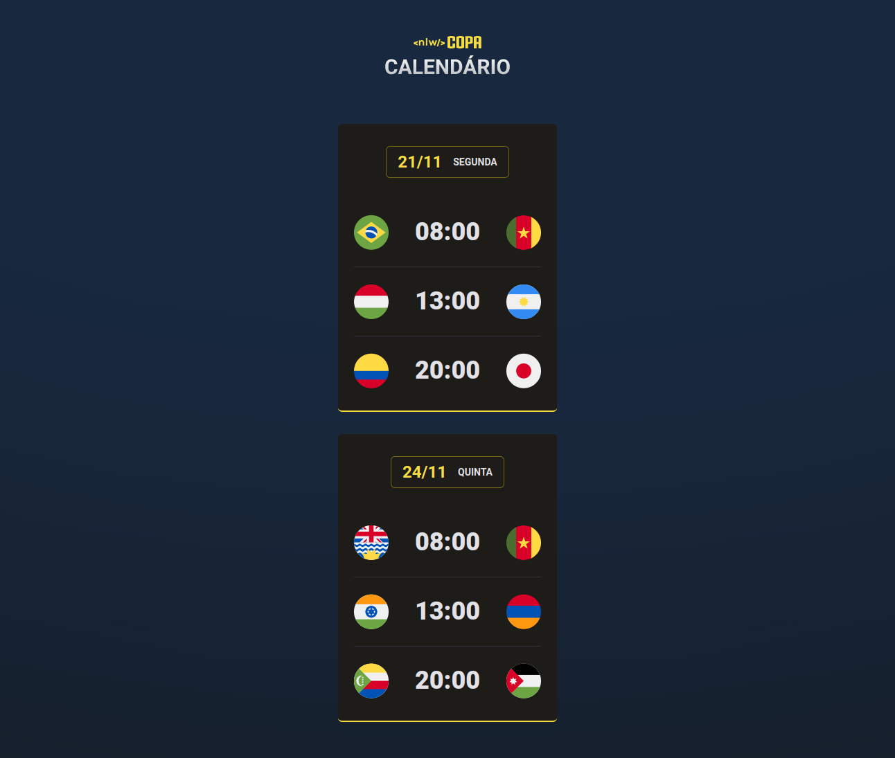

#

<h1 align="center">NLW Copa</h1>

  <a href="#-desktop">Desktop</a>&nbsp;&nbsp;&nbsp;|&nbsp;&nbsp;&nbsp;
  <a href="#-desktop">Mobile</a>&nbsp;&nbsp;&nbsp;|&nbsp;&nbsp;&nbsp;
  <a href="#-tecnologias">Tecnologias</a>&nbsp;&nbsp;&nbsp;

## 💻 Desktop

Versão Desktop do desafio da NLW Copa

## 📱 Mobile

Versão Mobile do desafio da NLW Copa

## ✨ Tecnologias

Esse projeto foi construido usando as seguintes tecnologias:

- [HTML5](https://www.w3schools.com/html/)
- [CSS3](https://www.w3schools.com/css/)
- [JavaScript](https://www.javascript.com/)