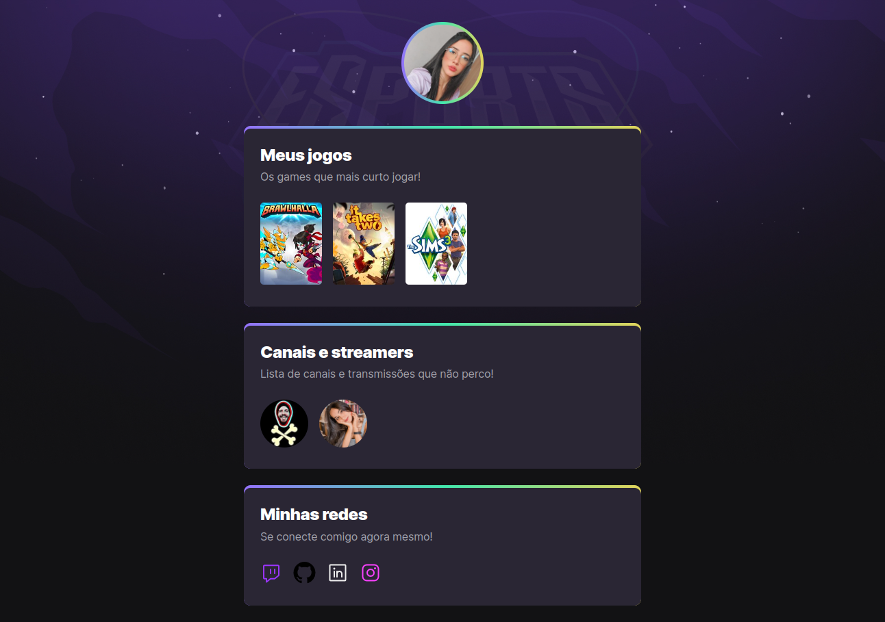

#

<h1 align="center">NLW E-Sports</h1>

  <a href="#-projeto">Projeto</a>&nbsp;&nbsp;&nbsp;|&nbsp;&nbsp;&nbsp;
  <a href="#-tecnologias">Tecnologias</a>&nbsp;&nbsp;&nbsp;

## 💻 Projeto

NLW ESports é um projeto para construir uma página com seus jogos e streamers favoritos.

## ✨ Tecnologias

Esse projeto foi construido usando as seguintes tecnologias:

- [HTML5](https://www.w3schools.com/html/)
- [CSS3](https://www.w3schools.com/css/)